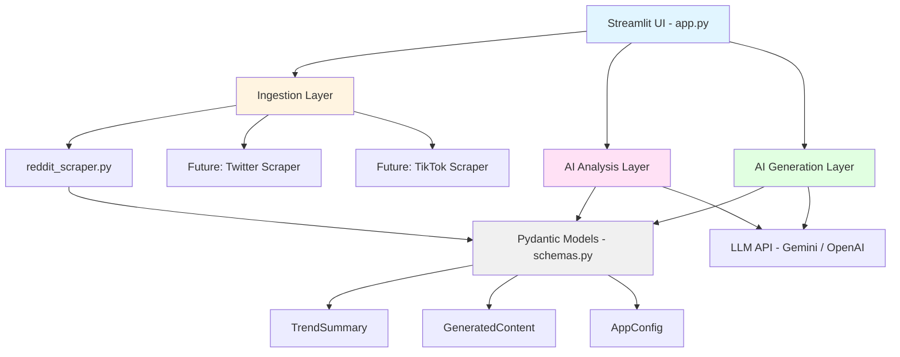
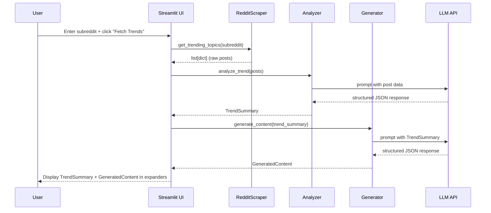
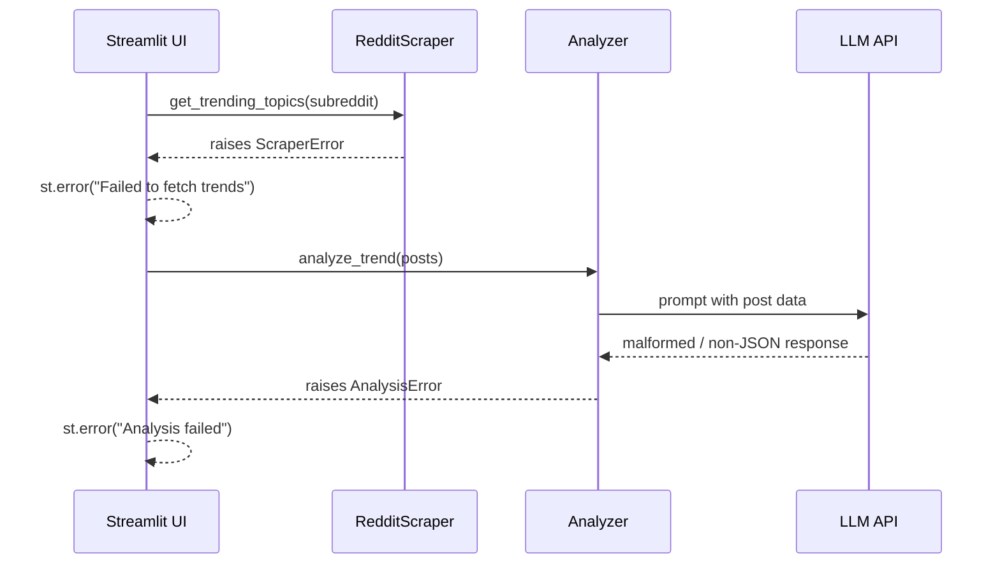

# Design Document: Trend-to-Content Automation Engine

## Overview

The Trend-to-Content Automation Engine is a Python-based system that automates the creation of brand-specific marketing content from trending social media topics. The system scrapes trending topics from Reddit (with extensibility for other platforms), uses LLM-powered analysis to understand the trend's context and sentiment, and generates tailored marketing assets including text posts, video scripts, and image prompts. The architecture follows a modular pipeline design with strict type validation using Pydantic, enabling reliable LLM input/output handling and easy extensibility to additional social platforms.

The system is built with Python 3.10+, uses Streamlit for the user interface, integrates with Gemini or OpenAI APIs for content analysis and generation, and employs `crawl4ai` for Reddit scraping via direct HTTP/HTML crawling. All components are designed with type safety, modularity, and testability as core principles.

The pipeline is intentionally staged: ingestion produces raw post data, analysis distills it into a structured `TrendSummary`, and generation consumes that summary to produce a `GeneratedContent` object. Each stage is independently mockable, making the system fully testable without live API credentials.

## Architecture



## Sequence Diagrams

### Main User Flow



### Error Handling Flow



## Components and Interfaces

### Component 1: RedditScraper (`src/ingestion/reddit_scraper.py`)

**Purpose**: Fetches trending posts from a given subreddit and returns them as a list of plain dicts. Uses `crawl4ai` to crawl Reddit pages directly via HTTP/HTML crawling — no Reddit API credentials required.

**Interface**:
```python
def get_trending_topics(subreddit: str, limit: int = 10) -> list[dict]:
    """
    Fetch top posts from the given subreddit using crawl4ai.

    Args:
        subreddit: Name of the subreddit (e.g. "technology").
        limit: Maximum number of posts to return.

    Returns:
        List of dicts with keys: title, score, num_comments, url, selftext.

    Raises:
        ScraperError: If the subreddit is invalid, the page is inaccessible,
                      or an HTTP error occurs.
    """
```

**Responsibilities**:
- Use `crawl4ai` to crawl `https://www.reddit.com/r/{subreddit}/hot.json` (or the HTML page)
- Parse the crawled response and normalize posts into plain dicts matching the expected schema
- Respect HTTP rate limits; raise `ScraperError` on HTTP 429 or other HTTP errors
- Provide a mock implementation for offline/test use

---

### Component 2: Analyzer (`src/ai/analyzer.py`)

**Purpose**: Accepts raw post data and uses an LLM to produce a structured `TrendSummary` explaining why the topic is trending, its sentiment, and any key cultural references or jokes.

**Interface**:
```python
def analyze_trend(posts: list[dict]) -> TrendSummary:
    """
    Analyze a list of Reddit posts and summarize the trend.

    Args:
        posts: Raw post dicts from get_trending_topics().

    Returns:
        TrendSummary with why_trending, sentiment, and key_joke fields.

    Raises:
        AnalysisError: If the LLM response cannot be parsed into TrendSummary.
    """
```

**Responsibilities**:
- Build a structured prompt from the post list
- Call the configured LLM (Gemini or OpenAI)
- Parse and validate the JSON response into a `TrendSummary` using Pydantic
- Raise `AnalysisError` on parse failure or API error

---

### Component 3: Generator (`src/ai/generator.py`)

**Purpose**: Accepts a `TrendSummary` and uses an LLM to produce brand-specific marketing assets as a `GeneratedContent` object.

**Interface**:
```python
def generate_content(trend: TrendSummary) -> GeneratedContent:
    """
    Generate marketing content based on a trend summary.

    Args:
        trend: Validated TrendSummary from analyze_trend().

    Returns:
        GeneratedContent with text_post, video_script, and image_prompt fields.

    Raises:
        GenerationError: If the LLM response cannot be parsed into GeneratedContent.
    """
```

**Responsibilities**:
- Build a structured prompt from the `TrendSummary`
- Call the configured LLM
- Parse and validate the JSON response into `GeneratedContent` using Pydantic
- Raise `GenerationError` on parse failure or API error

---

### Component 4: Streamlit UI (`app.py`)

**Purpose**: Provides the user-facing interface. Orchestrates the pipeline by calling ingestion, analysis, and generation in sequence and displaying results.

**Responsibilities**:
- Render a sidebar with subreddit text input and "Fetch Trends" button
- Call `get_trending_topics`, `analyze_trend`, and `generate_content` in sequence
- Display `TrendSummary` fields in a collapsible expander
- Display `GeneratedContent` fields in a collapsible expander
- Show `st.error` messages on any pipeline failure
- Show `st.spinner` during long-running operations

---

### Component 5: Config (`src/config.py`)

**Purpose**: Loads and validates all environment variables at startup using Pydantic's `BaseSettings`.

**Interface**:
```python
class AppConfig(BaseSettings):
    gemini_api_key: str | None = None
    openai_api_key: str | None = None
    llm_provider: Literal["gemini", "openai"] = "gemini"

    model_config = SettingsConfigDict(env_file=".env", env_file_encoding="utf-8")
```

## Data Models

### `TrendSummary` (`src/models/schemas.py`)

```python
from pydantic import BaseModel, Field

class TrendSummary(BaseModel):
    why_trending: str = Field(
        ...,
        description="A concise explanation of why this topic is trending.",
        min_length=10,
    )
    sentiment: Literal["positive", "negative", "neutral", "mixed"] = Field(
        ...,
        description="Overall sentiment of the trend.",
    )
    key_joke: str = Field(
        ...,
        description="The central meme, joke, or cultural reference driving the trend.",
        min_length=5,
    )
```

**Validation Rules**:
- `why_trending` must be at least 10 characters
- `sentiment` must be one of the four allowed literals
- `key_joke` must be at least 5 characters

---

### `GeneratedContent` (`src/models/schemas.py`)

```python
class GeneratedContent(BaseModel):
    text_post: str = Field(
        ...,
        description="A short social media text post (tweet/caption style).",
        min_length=10,
        max_length=500,
    )
    video_script: str = Field(
        ...,
        description="A short video script (30–60 seconds) referencing the trend.",
        min_length=50,
    )
    image_prompt: str = Field(
        ...,
        description="A detailed prompt for an AI image generator.",
        min_length=20,
    )
```

**Validation Rules**:
- `text_post` must be 10–500 characters
- `video_script` must be at least 50 characters
- `image_prompt` must be at least 20 characters

---

### Raw Post Dict Schema (informal)

```python
# Returned by get_trending_topics(); not a Pydantic model
{
    "title": str,        # Post title
    "score": int,        # Upvote score
    "num_comments": int, # Comment count
    "url": str,          # Post URL
    "selftext": str,     # Post body text (may be empty)
}
```

## Key Functions with Formal Specifications

### `get_trending_topics(subreddit, limit)`

```python
def get_trending_topics(subreddit: str, limit: int = 10) -> list[dict]:
```

**Preconditions:**
- `subreddit` is a non-empty string
- `limit` is a positive integer (1 ≤ limit ≤ 100)
- Network access to `reddit.com` is available

**Postconditions:**
- Returns a list of length ≤ `limit`
- Each dict contains keys: `title`, `score`, `num_comments`, `url`, `selftext`
- All values are of the correct type (str/int)
- Raises `ScraperError` if the subreddit does not exist, the page is inaccessible, or an HTTP error occurs (e.g., HTTP 429 rate limit)

**Loop Invariants:**
- During post normalization: all previously processed posts are valid dicts with the required keys

---

### `analyze_trend(posts)`

```python
def analyze_trend(posts: list[dict]) -> TrendSummary:
```

**Preconditions:**
- `posts` is a non-empty list
- Each dict in `posts` contains at least a `title` key
- LLM API key is configured

**Postconditions:**
- Returns a fully validated `TrendSummary` instance
- `result.sentiment` is one of `["positive", "negative", "neutral", "mixed"]`
- Raises `AnalysisError` if the LLM returns unparseable output or the API call fails

**Loop Invariants:** N/A (no loops; single LLM call with prompt construction)

---

### `generate_content(trend)`

```python
def generate_content(trend: TrendSummary) -> GeneratedContent:
```

**Preconditions:**
- `trend` is a valid `TrendSummary` instance (Pydantic-validated)
- LLM API key is configured

**Postconditions:**
- Returns a fully validated `GeneratedContent` instance
- `result.text_post` length is between 10 and 500 characters
- `result.video_script` length is at least 50 characters
- `result.image_prompt` length is at least 20 characters
- Raises `GenerationError` if the LLM returns unparseable output or the API call fails

**Loop Invariants:** N/A (single LLM call)

## Algorithmic Pseudocode

### Main Pipeline Algorithm

```python
# app.py — orchestration logic triggered by "Fetch Trends" button

def run_pipeline(subreddit: str) -> tuple[TrendSummary, GeneratedContent]:
    """
    Full pipeline: ingest -> analyze -> generate.
    """
    # Step 1: Ingest
    posts = get_trending_topics(subreddit, limit=10)
    # ASSERT: len(posts) >= 1 and all posts have required keys

    # Step 2: Analyze
    trend_summary = analyze_trend(posts)
    # ASSERT: isinstance(trend_summary, TrendSummary)

    # Step 3: Generate
    content = generate_content(trend_summary)
    # ASSERT: isinstance(content, GeneratedContent)

    return trend_summary, content
```

### LLM Prompt Construction (Analyzer)

```python
def _build_analysis_prompt(posts: list[dict]) -> str:
    """
    Build a structured prompt asking the LLM to return JSON matching TrendSummary.
    """
    titles = "\n".join(f"- {p['title']}" for p in posts)
    schema_json = TrendSummary.model_json_schema()

    prompt = f"""
You are a social media trend analyst. Analyze the following Reddit post titles
and return a JSON object that strictly matches this schema:

{schema_json}

Post titles:
{titles}

Return ONLY valid JSON. No markdown, no explanation.
"""
    return prompt
```

### LLM Response Parsing (shared pattern)

```python
def _parse_llm_response(raw: str, model_cls: type[BaseModel]) -> BaseModel:
    """
    Parse and validate a raw LLM JSON string into a Pydantic model.

    Raises:
        ValueError: If JSON is malformed.
        ValidationError: If the parsed dict does not match the schema.
    """
    # Strip markdown code fences if present
    cleaned = raw.strip().removeprefix("```json").removesuffix("```").strip()
    data = json.loads(cleaned)          # raises ValueError on bad JSON
    return model_cls.model_validate(data)  # raises ValidationError on schema mismatch
```

## Example Usage

```python
# --- Minimal end-to-end example ---

from src.ingestion.reddit_scraper import get_trending_topics
from src.ai.analyzer import analyze_trend
from src.ai.generator import generate_content

# 1. Fetch trending posts from r/technology
posts = get_trending_topics("technology", limit=5)
# posts == [{"title": "...", "score": 1234, ...}, ...]

# 2. Analyze the trend
trend = analyze_trend(posts)
# trend == TrendSummary(
#     why_trending="AI regulation bills are gaining momentum in Congress.",
#     sentiment="mixed",
#     key_joke="'Move fast and break laws' era is over.",
# )

# 3. Generate marketing content
content = generate_content(trend)
# content == GeneratedContent(
#     text_post="The AI regulation wave is here — is your brand ready? 🤖⚖️",
#     video_script="[HOOK] Everyone's talking about AI laws...",
#     image_prompt="A robot in a courtroom, dramatic lighting, editorial style...",
# )

print(content.text_post)
print(content.video_script)
print(content.image_prompt)
```

```python
# --- Mock usage (no API keys required) ---

from src.ingestion.reddit_scraper import get_mock_trending_topics
from src.ai.analyzer import get_mock_trend_summary
from src.ai.generator import get_mock_generated_content

posts = get_mock_trending_topics("worldnews")
trend = get_mock_trend_summary()
content = get_mock_generated_content()
```

## Error Handling

### Error Scenario 1: Invalid Subreddit

**Condition**: User enters a subreddit name that does not exist or is private.  
**Response**: `get_trending_topics` raises `ScraperError("Subreddit not found: {subreddit}")`.  
**Recovery**: Streamlit UI catches the exception and displays `st.error(...)`. The user can correct the subreddit name and retry.

---

### Error Scenario 2: LLM Returns Malformed JSON

**Condition**: The LLM response is not valid JSON or does not match the Pydantic schema.  
**Response**: `_parse_llm_response` raises `json.JSONDecodeError` or `pydantic.ValidationError`, which is caught and re-raised as `AnalysisError` or `GenerationError`.  
**Recovery**: UI displays `st.error(...)`. The pipeline can be retried; LLM responses are non-deterministic so a retry may succeed.

---

### Error Scenario 3: Missing API Credentials

**Condition**: `AppConfig` cannot find required environment variables (e.g., `GEMINI_API_KEY`).  
**Response**: Pydantic `ValidationError` raised at startup before any UI is rendered.  
**Recovery**: User must populate `.env` with the required keys and restart the app.

---

### Error Scenario 4: HTTP Rate Limit

**Condition**: Too many requests to Reddit in a short window.  
**Response**: `crawl4ai` receives an HTTP 429 response; caught and re-raised as `ScraperError("Rate limited by Reddit. Please wait before retrying.")`.  
**Recovery**: UI displays `st.error(...)` with a message to wait before retrying.

## Testing Strategy

### Unit Testing Approach

Each module is independently testable via its mock implementations. Tests live in a `tests/` directory mirroring `src/`.

Key unit test cases:
- `test_reddit_scraper.py`: Verify mock data shape, validate all required keys present, test `limit` parameter
- `test_analyzer.py`: Verify mock `TrendSummary` is valid, test `_parse_llm_response` with valid JSON, malformed JSON, and schema-mismatched JSON
- `test_generator.py`: Verify mock `GeneratedContent` is valid, test `_parse_llm_response` with edge cases
- `test_schemas.py`: Test Pydantic validation rules (min/max lengths, literal constraints)

### Property-Based Testing Approach

**Property Test Library**: `hypothesis`

Properties to test:
- For any non-empty list of post dicts with a `title` key, `_build_analysis_prompt` returns a non-empty string containing all titles
- For any valid `TrendSummary`, `generate_content` (mocked) returns a `GeneratedContent` where all field lengths satisfy their constraints
- For any string input to `_parse_llm_response`, the function either returns a valid model instance or raises `ValueError` / `ValidationError` — it never raises an unexpected exception

### Integration Testing Approach

Integration tests (marked with `@pytest.mark.integration`) require live API credentials and are excluded from CI by default:
- End-to-end pipeline test: real subreddit → real LLM → valid `GeneratedContent`
- Verify that live LLM responses consistently parse into valid Pydantic models across multiple runs

## Performance Considerations

- LLM API calls are the primary latency bottleneck (typically 2–8 seconds per call). The pipeline makes two sequential calls (analyze + generate); total latency is expected to be 4–16 seconds.
- Streamlit's `st.spinner` context manager should wrap the full pipeline call to provide user feedback during processing.
- Post fetching via `crawl4ai` is typically fast (<2 seconds) for typical limits (≤25 posts), depending on network latency and Reddit's response time.
- No caching is implemented in v1. Future iterations could cache `TrendSummary` results keyed by subreddit + timestamp window to reduce redundant LLM calls.
- The `limit` parameter on `get_trending_topics` directly controls prompt size; keeping it at 10–15 posts balances context richness against token cost.

## Security Considerations

- All API keys (Gemini, OpenAI) are loaded exclusively from environment variables via `python-dotenv` and `AppConfig`. They are never hardcoded or logged.
- `.env` must be listed in `.gitignore`. The repo ships `.env.example` with placeholder values only.
- LLM prompt inputs include user-supplied subreddit names and scraped post titles. These are treated as untrusted text and inserted into prompts as data (not instructions), reducing prompt injection risk.
- Reddit post content is displayed read-only in the UI; no user-supplied content is executed or rendered as HTML.
- `crawl4ai` performs read-only HTTP GET requests to Reddit; no write operations are performed. The scraper targets the public `.json` endpoint (`/r/{subreddit}/hot.json`) and does not require authentication.

## Dependencies

| Package | Purpose |
|---|---|
| `streamlit` | Web UI framework |
| `crawl4ai` | Reddit page scraper (HTTP/HTML crawling) |
| `google-generativeai` | Gemini LLM API client |
| `openai` | OpenAI LLM API client |
| `pydantic` | Data validation and settings management |
| `pydantic-settings` | `BaseSettings` for env var loading |
| `python-dotenv` | `.env` file loading |
| `hypothesis` | Property-based testing |
| `pytest` | Test runner |
